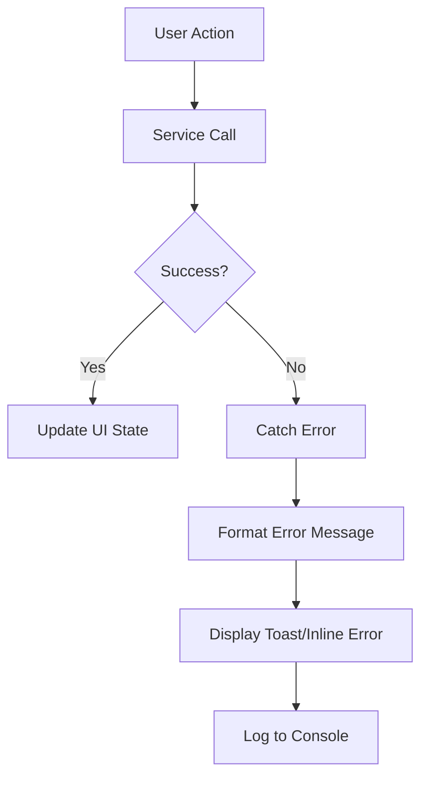

# Design Document

## Overview

This design document outlines the architectural improvements and implementation approach for optimizing the Pantry Tracker application. The optimization focuses on security, maintainability, performance, and user experience enhancements while maintaining the existing functionality.

## Architecture

### Current Architecture Issues

- Monolithic Firebase context with mixed concerns (auth, database, AI)
- Environment variables referenced but not properly configured
- No separation between service layer and presentation layer
- Limited error handling and loading state management

### Proposed Architecture

```
src/
├── config/
│   └── firebase.config.js          # Firebase initialization only
├── services/
│   ├── auth.service.js             # Authentication operations
│   ├── firestore.service.js        # Database operations
│   └── ai.service.js               # Recipe generation
├── hooks/
│   ├── useAuth.js                  # Auth state and methods
│   ├── useItems.js                 # Item CRUD operations
│   └── useRecipes.js               # Recipe generation and caching
├── context/
│   └── AuthContext.jsx             # Simplified auth context
├── components/
│   ├── common/
│   │   ├── ErrorBoundary.jsx
│   │   ├── Toast.jsx
│   │   ├── LoadingSpinner.jsx
│   │   └── ConfirmDialog.jsx
│   ├── auth/
│   │   ├── SignInForm.jsx
│   │   └── SignUpForm.jsx
│   └── items/
│       ├── ItemList.jsx
│       ├── ItemRow.jsx
│       ├── AddItemForm.jsx
│       └── ItemFilters.jsx
├── utils/
│   ├── validation.js               # Input validation helpers
│   ├── errorHandler.js             # Error formatting
│   └── constants.js                # App constants
└── types/
    └── propTypes.js                # Shared PropTypes definitions
```

## Components and Interfaces

### 1. Environment Configuration

**File: `.env`**
```
VITE_FIREBASE_API_KEY=your_api_key
VITE_FIREBASE_AUTH_DOMAIN=your_auth_domain
VITE_FIREBASE_PROJECT_ID=your_project_id
VITE_FIREBASE_STORAGE_BUCKET=your_storage_bucket
VITE_FIREBASE_MESSAGING_SENDER_ID=your_sender_id
VITE_FIREBASE_APP_ID=your_app_id
VITE_FIREBASE_MEASUREMENT_ID=your_measurement_id
VITE_FIREBASE_DATABASE_URL=your_database_url
VITE_GEMINI_API_KEY=your_gemini_key
```

**File: `.env.example`**
- Same structure with placeholder values
- Committed to repository for developer reference

### 2. Firebase Configuration Module

**File: `src/config/firebase.config.js`**

```javascript
import { initializeApp } from 'firebase/app';
import { getAuth } from 'firebase/auth';
import { getFirestore } from 'firebase/firestore';

const firebaseConfig = {
  apiKey: import.meta.env.VITE_FIREBASE_API_KEY,
  authDomain: import.meta.env.VITE_FIREBASE_AUTH_DOMAIN,
  projectId: import.meta.env.VITE_FIREBASE_PROJECT_ID,
  storageBucket: import.meta.env.VITE_FIREBASE_STORAGE_BUCKET,
  messagingSenderId: import.meta.env.VITE_FIREBASE_MESSAGING_SENDER_ID,
  appId: import.meta.env.VITE_FIREBASE_APP_ID,
  measurementId: import.meta.env.VITE_FIREBASE_MEASUREMENT_ID,
  databaseURL: import.meta.env.VITE_FIREBASE_DATABASE_URL
};

export const app = initializeApp(firebaseConfig);
export const auth = getAuth(app);
export const db = getFirestore(app);
```

**Design Rationale:**
- Single responsibility: only initializes Firebase
- Exports configured instances for use in services
- Environment variables properly loaded from .env

### 3. Service Layer

#### Auth Service

**File: `src/services/auth.service.js`**

**Methods:**
- `signUp(email, password)` - Create new user account
- `signIn(email, password)` - Authenticate existing user
- `signInWithGoogle()` - Google OAuth authentication
- `signOut()` - Log out current user
- `onAuthStateChange(callback)` - Subscribe to auth state changes

**Design Rationale:**
- Pure functions that don't manage state
- Return promises for async operations
- Throw descriptive errors for handling in UI layer

#### Firestore Service

**File: `src/services/firestore.service.js`**

**Methods:**
- `addItem(userId, itemName, quantity)` - Add or update item
- `getItems(userId)` - Fetch all user items
- `subscribeToItems(userId, callback)` - Real-time item updates
- `updateItem(itemId, updates)` - Update item fields
- `deleteItem(itemId)` - Remove single item
- `deleteItems(itemIds)` - Batch delete multiple items
- `saveRecipe(userId, ingredients, recipeHtml)` - Save generated recipe
- `getRecipes(userId)` - Fetch user's saved recipes
- `getCachedRecipe(userId, ingredients)` - Check for existing recipe

**Design Rationale:**
- All database operations centralized
- Consistent error handling
- Optimized queries with proper indexing
- Batch operations for efficiency

#### AI Service

**File: `src/services/ai.service.js`**

**Methods:**
- `generateRecipe(ingredients)` - Call Gemini API for recipe generation
- `formatRecipePrompt(ingredients)` - Create optimized prompt

**Design Rationale:**
- Isolated AI logic for easy testing and replacement
- Configurable prompt templates
- Error handling for API failures

### 4. Custom Hooks

#### useAuth Hook

**File: `src/hooks/useAuth.js`**

**Returns:**
```javascript
{
  user,              // Current user object or null
  loading,           // Boolean: auth state loading
  error,             // Error message or null
  signUp,            // Function
  signIn,            // Function
  signInWithGoogle,  // Function
  signOut            // Function
}
```

**Design Rationale:**
- Encapsulates auth service calls
- Manages loading and error states
- Provides clean API for components

#### useItems Hook

**File: `src/hooks/useItems.js`**

**Returns:**
```javascript
{
  items,             // Array of items
  loading,           // Boolean
  error,             // Error message or null
  addItem,           // Function
  updateItem,        // Function
  deleteItem,        // Function
  deleteItems,       // Function
  searchTerm,        // String
  setSearchTerm,     // Function
  sortBy,            // String
  setSortBy          // Function
}
```

**Design Rationale:**
- Manages item state and operations
- Implements search and sort logic
- Handles real-time updates

#### useRecipes Hook

**File: `src/hooks/useRecipes.js`**

**Returns:**
```javascript
{
  recipes,           // Array of saved recipes
  currentRecipe,     // Currently displayed recipe
  loading,           // Boolean
  error,             // Error message or null
  generateRecipe,    // Function
  saveRecipe,        // Function
  deleteRecipe,      // Function
  clearRecipe        // Function
}
```

**Design Rationale:**
- Manages recipe generation and caching
- Checks cache before API calls
- Handles recipe persistence

### 5. Component Improvements

#### Error Boundary

**File: `src/components/common/ErrorBoundary.jsx`**

**Purpose:** Catch React errors and display fallback UI

**Features:**
- Logs errors to console
- Displays user-friendly error message
- Provides reload button

#### Toast Notification System

**File: `src/components/common/Toast.jsx`**

**Purpose:** Display temporary success/error messages

**Features:**
- Auto-dismiss after 3-5 seconds
- Multiple toast support
- Different types: success, error, info, warning
- Positioned at top-right of screen

#### Loading Spinner

**File: `src/components/common/LoadingSpinner.jsx`**

**Purpose:** Reusable loading indicator

**Variants:**
- Full-page overlay
- Inline spinner
- Button spinner

#### Form Components

**Enhanced Features:**
- Real-time validation
- Error message display
- Disabled state during submission
- Clear visual feedback

## Data Models

### Item Document (Firestore)

```javascript
{
  id: string,              // Auto-generated document ID
  userId: string,          // Owner's user ID
  email: string,           // Owner's email
  itemName: string,        // Item name (trimmed, lowercase for search)
  quantity: number,        // Positive integer
  createdAt: timestamp,    // Server timestamp
  updatedAt: timestamp     // Server timestamp
}
```

**Indexes:**
- Composite: `userId` + `createdAt` (descending)
- Composite: `userId` + `itemName`

### Recipe Document (Firestore)

```javascript
{
  id: string,              // Auto-generated document ID
  userId: string,          // Owner's user ID
  ingredients: string[],   // Sorted array of ingredient names
  ingredientsHash: string, // Hash for quick lookup
  recipeHtml: string,      // Generated recipe HTML
  createdAt: timestamp,    // Server timestamp
  lastAccessedAt: timestamp // Updated on retrieval
}
```

**Indexes:**
- Composite: `userId` + `ingredientsHash`
- Composite: `userId` + `createdAt` (descending)

## Error Handling

### Error Types and Messages

**Authentication Errors:**
- `auth/email-already-in-use` → "This email is already registered"
- `auth/invalid-email` → "Please enter a valid email address"
- `auth/weak-password` → "Password must be at least 6 characters"
- `auth/user-not-found` → "No account found with this email"
- `auth/wrong-password` → "Incorrect password"

**Firestore Errors:**
- `permission-denied` → "You don't have permission to perform this action"
- `not-found` → "The requested item was not found"
- `unavailable` → "Service temporarily unavailable. Please try again"

**Validation Errors:**
- Empty item name → "Item name is required"
- Invalid quantity → "Quantity must be a positive number"
- Duplicate item → "This item already exists in your pantry"

### Error Handling Flow



## Testing Strategy

### Unit Tests

**Services:**
- Test each service method independently
- Mock Firebase SDK calls
- Verify error handling

**Hooks:**
- Test state management
- Test side effects
- Mock service calls

**Utilities:**
- Test validation functions
- Test error formatting
- Test helper functions

### Integration Tests

**User Flows:**
- Sign up → Add items → Generate recipe
- Sign in → View items → Delete items
- Search and filter items
- Edit item details

### Manual Testing Checklist

- [ ] Environment variables load correctly
- [ ] Authentication flows work
- [ ] Items CRUD operations function
- [ ] Recipe generation works
- [ ] Error messages display properly
- [ ] Loading states show correctly
- [ ] Responsive design on mobile/tablet/desktop
- [ ] Real-time updates work
- [ ] Batch operations complete successfully

## Performance Optimizations

### 1. Firestore Query Optimization

- Use composite indexes for common queries
- Implement pagination for large item lists
- Limit real-time listeners to active views only
- Use `onSnapshot` unsubscribe on component unmount

### 2. Recipe Caching Strategy

**Cache Key:** Hash of sorted ingredient names

**Cache Flow:**
1. User selects ingredients
2. Generate cache key from sorted ingredients
3. Check Firestore for existing recipe with same key
4. If found, return cached recipe
5. If not found, call Gemini API
6. Save result to Firestore with cache key

**Benefits:**
- Reduces API costs
- Faster response times
- Offline access to previous recipes

### 3. Search Debouncing

- Implement 300ms debounce on search input
- Prevents excessive re-renders
- Reduces unnecessary filtering operations

### 4. Component Optimization

- Use `React.memo` for list items
- Implement `useMemo` for expensive computations
- Use `useCallback` for event handlers passed to children
- Lazy load recipe modal component

## Security Considerations

### Firebase Security Rules

**Firestore Rules:**

```javascript
rules_version = '2';
service cloud.firestore {
  match /databases/{database}/documents {
    // Items collection
    match /items/{itemId} {
      allow read: if request.auth != null && 
                     resource.data.userId == request.auth.uid;
      allow create: if request.auth != null && 
                       request.resource.data.userId == request.auth.uid &&
                       request.resource.data.itemName is string &&
                       request.resource.data.quantity is number &&
                       request.resource.data.quantity > 0;
      allow update: if request.auth != null && 
                       resource.data.userId == request.auth.uid;
      allow delete: if request.auth != null && 
                       resource.data.userId == request.auth.uid;
    }
    
    // Recipes collection
    match /recipes/{recipeId} {
      allow read: if request.auth != null && 
                     resource.data.userId == request.auth.uid;
      allow create: if request.auth != null && 
                       request.resource.data.userId == request.auth.uid;
      allow delete: if request.auth != null && 
                       resource.data.userId == request.auth.uid;
    }
  }
}
```

### Client-Side Security

- Never expose API keys in client code (use .env)
- Validate all user inputs before submission
- Sanitize data before displaying (prevent XSS)
- Implement rate limiting for API calls
- Use HTTPS only (enforced by Firebase Hosting)

## UI/UX Improvements

### Visual Enhancements

1. **Toast Notifications**
   - Success: Green background, checkmark icon
   - Error: Red background, X icon
   - Info: Blue background, info icon

2. **Loading States**
   - Skeleton loaders for item list
   - Spinner on buttons during submission
   - Progress indicator for recipe generation

3. **Animations**
   - Fade in/out for toasts
   - Slide in for modals
   - Smooth transitions for list updates

4. **Responsive Design**
   - Mobile: Single column, touch-friendly buttons
   - Tablet: Two-column layout
   - Desktop: Full table view with hover effects

### Accessibility

- Proper ARIA labels on interactive elements
- Keyboard navigation support
- Focus indicators on all focusable elements
- Screen reader friendly error messages
- Sufficient color contrast ratios

## Migration Strategy

### Phase 1: Environment Setup
1. Create .env and .env.example files
2. Update .gitignore
3. Test environment variable loading

### Phase 2: Service Layer
1. Create firebase.config.js
2. Implement auth.service.js
3. Implement firestore.service.js
4. Implement ai.service.js

### Phase 3: Hooks and Context
1. Create custom hooks
2. Simplify AuthContext
3. Update components to use hooks

### Phase 4: UI Components
1. Add ErrorBoundary
2. Implement Toast system
3. Add LoadingSpinner
4. Enhance form components

### Phase 5: Features and Optimization
1. Add input validation
2. Implement recipe caching
3. Add search debouncing
4. Implement batch operations

### Phase 6: Security and Testing
1. Deploy Firebase security rules
2. Test all user flows
3. Performance testing
4. Security audit

## Deployment Considerations

- Ensure all environment variables are set in hosting platform
- Test with production Firebase project
- Monitor Firestore usage and costs
- Set up error logging (e.g., Sentry)
- Configure caching headers for static assets
